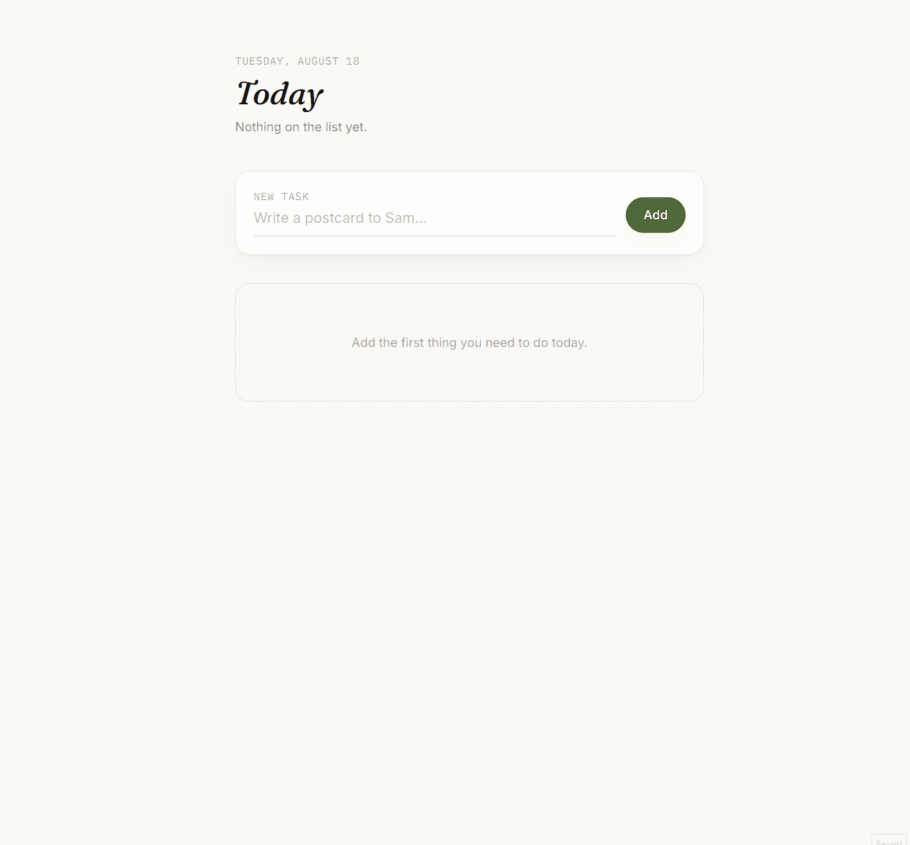

# ✅ Today — A Supabase Todo App

A small, focused todo app built with Next.js App Router, Tailwind CSS, and Supabase — no client-side data fetching, no `useState` for your data. Reads happen in a Server Component, writes happen through Server Actions.

## ✨ Features

- 📝 **Add, complete, delete** — a clean daily task list backed by a real Postgres database
- 🎨 **Modern, minimal UI** — warm paper background, serif heading, styled with Tailwind CSS
- ⚡ **Server-first** — tasks are fetched in a Server Component; no API routes, no client-side Supabase calls
- 🔄 **Works without JavaScript** — add/complete/delete are plain HTML forms bound to Server Actions
- 🔒 **Secure by default** — Supabase URL/key live in environment variables, never bundled into client code paths that need them
- 🚀 **Easy deployment** — deploys to Vercel in a few clicks

## 🎬 Demo



## 🛠️ Tech Stack

- **Framework**: [Next.js 14](https://nextjs.org) (App Router, Server Actions)
- **Language**: TypeScript
- **Styling**: Tailwind CSS v4
- **Database**: [Supabase](https://supabase.com) (Postgres + Row Level Security)
- **Deployment**: Vercel

## 📦 Getting Started

### Prerequisites

1. Create a free Supabase project:
   - Visit [supabase.com](https://supabase.com) and sign in with GitHub
   - Click **New Project**, choose a name, password, and region

2. Set up the database table:
   - Open **SQL Editor** in your Supabase project
   - Run the contents of [`supabase/schema.sql`](./supabase/schema.sql)
     (already have a `todos` table without `is_complete`? Run
     [`supabase/migration_add_complete.sql`](./supabase/migration_add_complete.sql) instead)

3. Clone the repository:
```bash
git clone https://github.com/Zenyonmz/today-todo.git
cd today-todo
```

4. Install dependencies:
```bash
npm install
```

5. Set up environment variables:
Create a `.env.local` file:
```env
NEXT_PUBLIC_SUPABASE_URL=https://your-project-ref.supabase.co
NEXT_PUBLIC_SUPABASE_ANON_KEY=your-anon-public-key
```
(Found under **Project Settings → API** in your Supabase dashboard.)

6. Start the development server:
```bash
npm run dev
```

7. Open http://localhost:3000 in your browser

## 🎯 How to Use

1. Type a task into the **New task** field and click **Add**
2. Click the circle next to a task to mark it complete
3. Hover over a task and click the **×** to delete it
4. Every action writes straight to your Supabase `todos` table — check the Table Editor to see it update live

## 📁 Project Structure

```text
todo-app/
├── app/
│   ├── actions.ts          # Server Actions: addTask, deleteTask, toggleTask
│   ├── layout.tsx          # Root layout, loads fonts
│   ├── page.tsx            # Server Component — fetches todos from Supabase
│   └── globals.css         # Tailwind v4 theme + base styles
├── components/
│   ├── AddTaskForm.tsx     # Form bound to the addTask action
│   └── TaskRow.tsx         # One task: toggle-complete + delete forms
├── lib/
│   ├── supabase/server.ts  # Supabase client (server-side only)
│   └── types.ts
├── supabase/
│   ├── schema.sql                  # Full table + RLS policies (fresh project)
│   └── migration_add_complete.sql  # Adds is_complete to an existing table
├── .env.local               # Environment variables (not committed)
└── README.md
```

## 🚀 Deploy to Vercel

1. Push this repo to GitHub
2. Log in to [Vercel](https://vercel.com) and click **New Project**
3. Import this repository
4. Add environment variables `NEXT_PUBLIC_SUPABASE_URL` and `NEXT_PUBLIC_SUPABASE_ANON_KEY`
5. Deploy

## 📝 Configuration

### Table schema

The app expects a `todos` table with `id`, `task`, `is_complete`, and `created_at` columns, and RLS policies allowing public select/insert/update/delete (see `supabase/schema.sql`). For real users, scope these policies to `auth.uid()` instead of `true`.

### Styling

Colors and fonts are defined in `app/globals.css` under `@theme` (Tailwind v4's CSS-first config) rather than a `tailwind.config.ts` file.

## 🤝 Contributing

Issues and Pull Requests are welcome!

## 📄 License

MIT License

## 🙏 Acknowledgments

- [Next.js](https://nextjs.org) — React framework
- [Supabase](https://supabase.com) — Postgres database & auth
- [Tailwind CSS](https://tailwindcss.com) — CSS framework

⭐ Star this project if you find it helpful!
